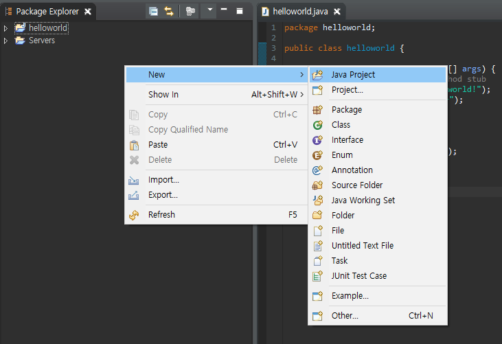
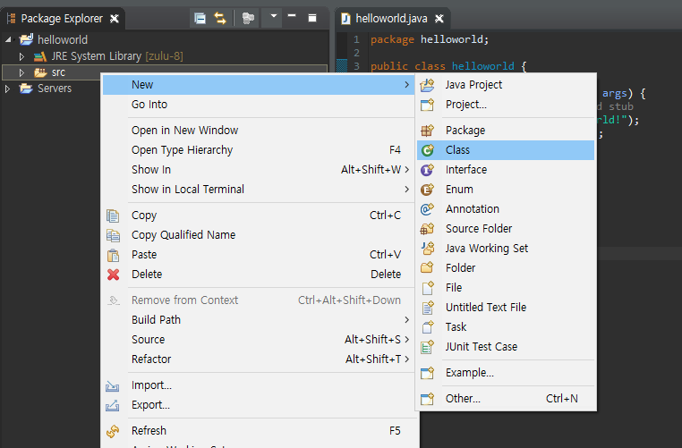
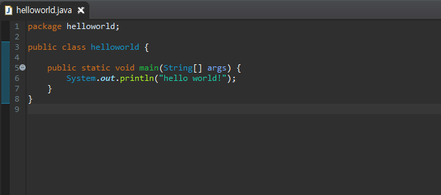
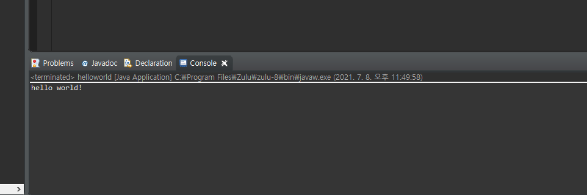

# Java\_데이터타입\_변수_연산자

## 1. Java 기본

Download

+ JDK8 zulu 8.33.0.1 : (https://cdn.azul.com/zulu/bin/zulu8.33.0.1-jdk8.0.192-win_x64.msi) 

+ Eclipse eclipse-jee-2018-09-win32-x86_64.zip : (https://www.eclipse.org/downloads/download.php? file=/technology/epp/downloads/release/2018-09/R/eclipse-jee-2018-09-win32-x86_64.zip) 

+ STS Spring Tool Suite 3.9.14 (Eclipse 4.15) : (https://download.springsource.com/release/STS/3.9.14.RELEASE/dist/e4.15/spring-tool-suite-3.9.14.RELEASEe4.15.0-win32-x86_64.zip) 

+ Apache Tomcat Tomcat 9.0.41 : (https://downloads.apache.org/tomcat/tomcat-9/v9.0.41/bin/apache-tomcat-9.0.41-windowsx64.zip) 

+ Install & setting zulu 8.33.0.1 : 내PC -> 속성 -> 고급시스템설정 -> 고급 -> 환경변수 -> 시스템변수 

| 변수 이름 | 변수 값                      |
| --------- | ---------------------------- |
| JAVA_HOME | C:\Program Files\Zulu\zulu-8 |
| CLASSPATH | .                            |
| Path      | %JAVA_HOME%\bin;기존경로     |

## 1.1 Write Once, Run Anywhere

+ Write Once, Run Anywhere(WORE)는 썬 마이크로시스템즈에 의해 만들어진 자바 크로스/플랫폼에 의한 이익을 표현하기 위한 표어이다. 
+ 자바가 **표준 바이트코드로 컴파일**되고, **자바 가상 머신이 장착된 어떤 장비에서도 실행**될 수 있음을 의미한다.
  + `.java`파일을 컴파일 하면 `.class`파일(바이트파일)로 변하고 장비 위에 설치된 JVM(자바 가상 머신)에서 이를 읽고 실행(Run)한다.
  + Java는 처음 냉장고, TV, 에어컨, 세탁기와 같은 백색 가전들을 서로 어떻게 소통하게 해야할지를 고민하다가 탄생한 언어다.
    + 각기 다른 장비에서 어떻게 통합적으로 소통하고 작업할 수 있을까? -> 자바 가상 머신으로 해결

<br/>

<br/>

## 1.2 Windows 10 기준 JAVA_HOME에 맞는 값

+ Zulu Open JDK 1.8을 설치한다고 할 때, zulu jdk 관련 폴더의 최상위 디렉토리가 환경변수 JAVA_HOME의 값이 된다.
  + 즉, bin폴더나 jre폴더, lib폴더의 상위 폴더가 된다.
+ 왜 설정해야 할까?
  + 자바 진영에 있는 많은 소프트웨어들은 기본적으로 자바가 설치되어 있는 폴더를 공유한다.(java.exe) JVM 혹은 JDK가 설치되어 있는 곳을 알아야 실행이 가능하기 때문이다.

+ JRE & JDK
  + 바이트코드를 실행하기 위한 JVM은 JRE에 있다. 이 바이트코드는 '완성된 코드'다. 이 완성된 코드를 만들기 위해서 컴파일러부터 다양한 도구들이 필요하다. 이 도구들이 JDK에 있다. 즉, JDK는 JRE + Tool
  + 따라서, 배포되는 서버쪽에는 코드를 굴릴 JVM이 있는  JRE만 있으면 된다.

<br/>

<br/>

### 1.3 Eclipse와 같은 IDE를 사용하는 이유 

+ Coding - Compile - Run - Build - Deploy의 개발 및 적용 전체 과정을 일반 에디터(notepad 등)와 CLI 모드를 사용하면 매우 불편하다. IDE를 사용하면 하나의 개발 툴로 편리하고, 일관성있게 관리할 수 있다.
+ eclipse Java Project 생성 화면



+ 새로운 java파일 생성



+ Hello World 코드 작성
  + `ctrl` + `spacebar`를 통해서 자동 완성 기능 사용 가능
    + ex. 'syso' 치고 `ctrl` + `spacebar`를 누르면 출력문 자동 완성



+ Run을 통해 실행



<br/>

<br/>

<br/>

## 2. Type

+ Machine의 Memory Allocation & Management
+ Primitive Type
  + 미리 정해진 크기의 Memory Size로 표현
+ Reference Type
  + 미리 정해질 수 없는 데이터의 표현

### 2.1 Java의 Primitive Type

+ 논리형 
  + boolean (1bit)
+ 정수형
  + byte (8)
  + short (16)
  + **int** (32) (기본)
  + long (64)
+ 실수형
  + float (32)
  + **double** (64) (기본)
+ 문자형
  + char (16)

<br/>

<br/>

### 2.2 byte type

+ 이진수를 이용한 type
+ `00001001`은 9
+ `10001001`은 -119
  + 맨 앞 bit는 부호를 나타낸다. 쉽게 생각해서, 맨앞 비트가 1이 붙은 순간 -2^8, -128이 된다. 여기서 뒤를 이진법으로 읽은 9를 빼면 된다.
    + 혹은 0의 비트들만을 더한 상태에서 -1을 해준다.
  + 맨 앞 bit가 1이면 음수로 보기 때문에 이 8bit를 이용해 나타낼 수 있는 최대 양수는 `0111111`, 127이다.

<br/>

<br/>

### 2.3 형변환(Type-Casting)

+ 서로 다른 Type의 변수 할당

+ 작은 Type -> 큰 Type : 자동 형변환

  + ```java
    byte b = 2;
    int i = b;
    ```

+ 큰 Type -> 작은 Type : 오류, 명시적 형변환 필요

  + ```java
    int i = 2000;
    byte b = (byte) i;
    ```

+ 다만, 예외적으로 정수형은 실수형으로 자동 형변환(지양)

  + ```java
    long var = 100;
    float fvar = var;
    ```

<br/>

#### 2.3.1 형변환 예제

```java
int k = 66;
char c = (char) k; // c : B

c = 'A';
k = c; // k : 65

int i = 10 / 3; // i : 3, 10과 3은 정수이고 정수 / 정수를 했으므로 정수가 결과로 나온다.

float f = 10 / 3; // f = 3.0, 위와 같이 정수가 결과로 나오지만 이를 float로 형변환한다.

float f2 = 10f / 3F; // f2 = 3.3333333, 10과 3을 먼저 실수로 바꾸고 나눗셈 연산. 즉, 애초에 결과가 실수로 나오게 된다.

double d = 10d / 3D; // d = 3.3333333333333335, double이라 더 자세하게. 뒤의 5는 그냥 오차

System.out.println(( 10 / 3) * 3); // 9출력. 10 / 3을 먼저 계산해서 3이 되고 3을 곱하는 것
```

<br/>

<br/>

### 2.4 String 타입(reference type)

+ 선언 및 할당 방식

```java
String s = "Hello";
String s = new String("Hello"); // 객체 생성
```

+ java.lang.String
+ 상수 문자열 객체를 이용하는 것이 일반 String 객체를 이용하는 방법보다 효율적 (위 코드에서 첫 번째)

<br/>

<br/>

<br/>

## 3. Variable

+ Type 별로 선언(declaration)
+ 값(Value)을 할당(assing) 후 변경 및 사용
+ Local Variable은 Default Value X, 즉 할당 후에야 사용 가능
+ long, float, double type value

| type   | 표현 | 예시                          |
| ------ | ---- | ----------------------------- |
| long   | l, L | long value = 19874333L;       |
| float  | f, F | float f = 13.579F;            |
| double | d, D | double d = 13.579d; 생략 가능 |

### 3.1 Primitive Type & Variables

+ Primitive Type은 미리 정해진 크기의 공간으로 그 안에 value가 들어간다.
+ 따라서, 더 큰 공간을 요구하는 value를 더 작은 공간을 갖는 Type의 변수에 넣을 수 없다.
  + ex. `int i =10; byte b = i;` 불가능 byte 타입보다 int 타입이 크다. 형변환이 필요하다. `byte b = (byte) i;`

<br/>

<br/>

### 3.2 Local variale

+ 기본적으로 변수는 Local Variable이며 하나의 중괄호 `{}`안에서만 유효하다. 따라서, 아래의 코드는 같은 main 함수 안에 있다고 해도 두 번째 출력문에서 에러가 발생한다.

```java
public class Test {
    public static void main(String[] args) {
        {
            int i = 0;
            System.out.println(i);
        }
        
        System.out.println(i);
    }
}
```

<br/>

<br/>

### 3.3 final

+ final은 상수로 지정하겠다는 의미다. 따라서, 아래의 코드는 `i = 10;` 문장에서 에러가 발생한다.
  + final이 붙은 변수는 이후에 재할당이 불가능하다.

```java
public class Test {
    public static void main(String[] args) {
        
        final int i = 0;
        System.out.println(i);
        
        i = 10;
        System.out.println(i);
    }
}
```

<br/>

<br/>

### 3.4 Reference Type & Variables

+ Reference Type은 미리 만들 수 없는 데이터를 별도의 저장 공간에 만들어 놓고 **그 공간의 주소를 저장**
  + 공간은 **Heap**
  + 즉, variable 안에는 값이 아닌 주소가 저장된다.

<br/>

<br/>

<br/>

## 4. Operator

### 4.1 주요 연산자

| 구분          | 연산자                   |
| ------------- | ------------------------ |
| 더하기        | +                        |
| 빼기          | -                        |
| 곱하기        | *                        |
| 나누기 몫     | /                        |
| 나눈 나머지   | %                        |
| 값 증가, 감소 | ++, --                   |
| 논리 부정     | !                        |
| 값 비교       | ==, !=                   |
| 대소          | >, <, >=, <=             |
| 논리 AND, OR  | &&, \|\|, &, \|          |
| Bit           | <<, >>, >>>, ~, &, \|, ^ |
| 삼항          | ?                        |

<br/>

<br/>

### 4.2 `++`, `--` 연산자

+ `++`, `--` 연산자가 변수 뒤에 붙으면 이는 변수를 한 번 사용하고 나서 값을 증/감하겠다는 의미다.

```java
public static void main(String[] args) {
    int i = 10;
    System.out.println( ( i-- ) % 2 ); // 0, i가 한 번 사용이 되고 감소. 즉, 이미 10 % 2, i는 그다음 9가 된다.
    System.out.println( --i ); // 8, i가 먼저 9에서 8로 감소되고 출력
    System.out.println( i++ ); // 8, i가 8인 상태에서 먼저 출력되고 9로 증가
    System.out.println( ++( i - 2) ); // 컴파일 에러, 연산자가 변수에 붙어야 하는데 수식에 붙었다.
}
```

<br/>

<br/>

### 4.3 Bit

+ `*`, `/` 연산자에 비해 훨씬 속도가 빠르다.

+ `>>`, `<<`는 부호 비트를 유지한 상태에서 쉬프트가 일어난다.
+ `>>>`는 부호 비트를 유지하지 않은 상태에서 쉬프트가 일어난다.
  + 즉, `>>`의 경우 부호 비트가 1이면 1이 앞에 채워지지만 `>>>`는 부호 비트가 1이어도 앞에 0으로 채워진다.

```java
public static void main(String[] args) {
    System.out.println( 3 & 4); // 0, 0011 & 0100
    System.out.println( 3 | 4); // 7
    System.out.println( 3 ^ 4); // 7, XOR, 두 비트가 서로 다를 때만 1
    System.out.println( ~ 4 ); // -5, 0100 -> 1011, 비트를 전부 바꾼다. -8 + 3, 혹은 0의 비트만 읽고 -1 (-4 - 1)
    
    System.out.println( 1 << 2 ); // 4
    // .... 0000 0001
    // .... 0000 0100
    
    System.out.println( 3 << 3 ); // 24
    // .... 0000 0011
    // .... 0001 1000
    
    System.out.println( 1 >> 2 ); // 0
    // .... 0000 0001
    // .... 0000 0000
    
    System.out.println( -16 >> 2 ); // -4
    // .... 1111 0000
    // .... 1111 1100
    
    System.out.println( 7 >>> 2 ); // 1
    // 0000 .... 0000 0111
    // 0000 .... 0000 0001
    
    System.out.println( -5 >>> 24 ); // 255
    // 1111 1111 1111 1111 1111 1111 1111 1011
    // 0000 0000 0000 0000 0000 0000 1111 1111
}
```

<br/>

<br/>

### 4.4 주사위 만들기

+ Java 8 api : https://docs.oracle.com/javase/8/docs/api/
+ Math.random()은 0.0 이상 1.0 미만의 double을 반환
  + 자주 사용되다보니 java.util.Random에 추가됨

```java
public static void main(String[] args) {
    
    int N = 6;
    
    // Math.random()
    System.out.printf( "%3d", (int) (Math.random()*N) + 1);
    
    // java.util.Random -> 객체 생성
    java.util.Random generator = new java.util.Random();
    System.out.printf( "%3d", generator.nextInt(N) + 1 );
    
    // %
    System.out.printf( "%3d", ( (int) (Math.random()*100) % N ) + 1 );
}
```

